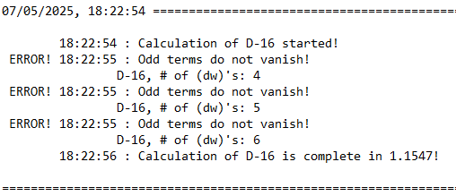

# MATLAB Code for "Chern-Simons potentials of higher-dimensional Pontryagin densities"

This repository contains the MATLAB code used in the calculation of Cherns-Simons-like potentials from gravitational Pontryagin densities in higher even dimensions
```math
P_{2n} = R^{i_1}_{i_2}\wedge R^{i_2}_{i_3}\wedge \dots \wedge R^{i_{2n-1}}_{i_{2n}},
```
presented in the paper:

> **Title:** *Chern-Simons potentials of higher-dimensional Pontryagin densities*<br>
> **Authors:** Onur Ayberk Çakmak, Özgür Sarıoğlu<br>
> **arXiv:** [](https://arxiv.org/)

## Table of Contents

- [Requirements](#Requirements)
- [Repository Structure](#Repository-Structure)
- [Overview](#Overview)
- [How to Run](#How-to-Run)
- [License](#license)


## 🛠️ Requirements
This code was developed and tested using:
- **MATLAB** R2023b or later
  
To check the version of your Matlab program, run
```matlab
ver
```
Additionally, to be able to display part of the ouput, 
- Excel or equivalent and
- Notepad or equivalent
  
are needed.

## Repository Structure
```graphql
pontryagin-calc/
├── main.m            # Main file to be executed
├── images/           # Folder containing sample images
├── src/              # Source folder containing .m files
│    ├── dec2sym.m        # Decimal number to symbolic text conversion
│    ├── derivGen.m       # Total derivative generator from event terms
│    ├── genCycPerm.m     # Cyclic permutation generator from input decimal
│    ├── genPerm.m        # Unique cyclic permutation generator in D-dimension
│    ├── genPwrStr.m      # Function to convert decimal to superscript text
│    ├── intByParts.m     # Function to apply integration by parts
│    ├── permSplit.m      # Function to find consecutive binary digit repetitions
│    ├── rpt2pwr.m        # Function to convert repeated number to number raised to power
│    ├── saveMat.m        # Matrix saver
│    └── toLog.m          # Log keeper
├── data_D2to32.zip   # Zip folder containing data generated for D=2 to D=32 dimension
├── backup/*          # Folder to store the previously generated outputs
├── matrices/*        # Folder to store the generated matrices
├── excel_files/*     # Folder to store the generated excel files
├── README.md         # Project documentation
└── LICENSE           # License file (CC v4.0)
```

The folders with asterisk are generated at runtime. 

## Overview
### How to Run
- Extract the zip folder in a directory of your choice in your computer, but <ins>**DO NOT**</ins> change the hierarchy of the folders and files inside!
  - If the hierarchy needs to change, paths in params.paths should be updated accordingly.
- Adjust the input parameters in the "main.m" file:
  - <ins>dimMin:</ins> The starting dimension of the computation.
  - <ins>dimMax:</ins> The ending dimension of the computation.
  - <ins>enableLog:</ins> Set as 1 to enable log keeping, set as 0 otherwise.
  - <ins>enableMatrixWrite:</ins> Set as 1 to enable erroneous matrices to be written in the log file, set as 0 otherwise. "enablaLog" flag must be raised.
  - <ins>txtForm:</ins> This variable is for adjusting the formatting of the log file. Set as 1 if the log file is to be displayed in notepad, set as 2 for notepad++.
  - <ins>tolerance:</ins> Tolerance value below which a variable is considered as 0.
- Run the "main.m" file:
```matlab
main.m
```

### Output
The code first checks whether the folders in which the output files will be stored exist. These folders are 
- "matrices", which will hold the subfolders for different permutation classes ($P^{(\bar{a},n-a)}, a=1,\dots,n $);
  - "(a,n-a)"s, which will hold the relevant matrices for the $P^{(\bar{a},n-a)}, a=1,\dots,n$ permutation classes;
- "excel_files", which will hold the excel tables for the given dimension;
- "backup", which will hold the previously generated outputs.

Any missing folder will be reproduced by the code at the beginning of the run. Upon execution, if the output data folders already exist and contain output files from previous execution, a backup subfolder is generated under the "backup" folder (See "Backup" section). 

The main output of the code is "totDerivExcel.xlsx" file which contains the total derivative contributions from each permutations class and the associated coefficients for the desired dimensions as a table. The format of the file is given below for dimensions from $D=2$ to $D=8$:

| $D-2$ | $\omega$   |                            |                              |                                                  |                            |
|-------|------------|----------------------------|------------------------------|--------------------------------------------------|----------------------------|
|       | 1          |                            |                              |                                                  |                            |
| $D-4$ | $\omega^3$ | $(\text{d}\omega)\omega$ |                              |                                                  |                            |
|       | 2/3        | 1                          |                              |                                                  |                            |
| $D-6$ | $\omega^5$ | $(\text{d}\omega)\omega^3$ | $(\text{d}\omega)^2\omega$   |                                                  |                            |
|       | 3/5        | 3/2                        | 1                            |                                                  |                            |
| $D-8$ | $\omega^7$ | $(\text{d}\omega)\omega^7$ | $(\text{d}\omega)^2\omega^3$ | $(\text{d}\omega)\omega(\text{d}\omega)\omega^2$ | $(\text{d}\omega)^3\omega$ |
|       | 4/7        | 2                          | 8/5                          | 4/5                                              | 1                          |

Every two rows give the different total derivative term contributions and their coefficients, respectively. To read off the Chern-Simons-like potential for a given dimension, one needs to add up all the contributions in the upper row multiplied by the coefficients below them. For instance, in $D=6$ the potential term is given by the elements of the fifth row multiplied by the sixth row summed up:
```math
  CS_5 = \dfrac{3}{5}\omega^5 + \dfrac{3}{2}(\text{d}\omega)\omega^3 + (\text{d}\omega)^2\omega,
```

where the wedge products are suppressed. Another excel file named "coeffExcel.xlsx", containing the coefficients of the even terms coming from the expansion of the Pontryagin density is created. The format of this file (for $D=2$ to $D=12$) is as follows:

| Dimension | (dω)⁰ | (dω)¹ | (dω)²   | (dω)³   | (dω)⁴     | (dω)⁵     | (dω)⁶   |
|-----------|-------|-------|---------|---------|-----------|-----------|---------|
| 2-D       | 1     | 1     |         |         |           |           |         |       
| 4-D       | 1     | 2     | 1       |         |           |           |         |       
| 6-D       | 1     | 3     | 3       | 1       |           |           |         |        
| 8-D       | 1     | 4     | 4 2     | 4       | 1         |           |         |         
| 10-D      | 1     | 5     | 5²      | 5²      | 5         | 1         |         |         
| 12-D      | 1     | 6     | 6² 3    | 6³ 2    | 6² 3      | 6         | 1       |         

Here, each column represents a different permutation class (different number of $\text{d}\omega$ piece), while each row represents a different dimension. The even terms are not displayed themselves, but instead their coefficients are shown. The coefficients within each cell are presented in decreasing order, with repeated coefficients denoted using powers. The total number of coefficients (including powers) in each cell gives the number of distinct even terms for that dimension and number of $\text{d}\omega$ pieces. For example, in $D=12 with 3 $\text{d}\omega$, the coefficients are given by 6, 6, 6 and 2. Hence the contribution to the Pontryagin density is 
```math
6(...) + 6(...) + 6(...) + 2(...),
```

where the terms in the parenthesis correspond to the elements of the distinct permutation set $P^{(3,3)}_\text{dist}$.

Additionally, in the matrices folder a subfolder for each dimension from "dimMin" up to "dimMax" are created. In each such subfolder separate subsubfolders are generated for each permutation class (classes of different number of $\text{d}\omega$ pieces) with the name format 
```math
(a)-(n-a),
```

where $a=1,\dots,n$ and $n=D/2$, $D$ being the corresponding dimension. The matrices calculated during the computation of total derivative contribution from each permutation class (see equation (3.4) and (3.6) from our paper) are stored in the folder for the associated permutation class. These matrices are ".mat" files which can be viewed in MATLAB. The mentioned matrices are
- $M^{(\bar{a},n-a)}_\text{even}$,
- $M^{(\bar{a},n-a)}_\text{odd}$,
- $u^{(\bar{a},n-a)}_\text{even}$,
- $u^{(\bar{a},n-a)}_\text{d}$,
- $u^{(\bar{a},n-a)}_\text{odd}$.

At the end of each of these matrices' names a text is attached to indicate the total number of $\text{d}\omega$ pieces in the permutation $a$ and $n-a$. 
An example output for $P^{(\bar{3},2)}$ in $D=10$ is given below 


Finally, a time stamp file "startTime.m" file is generated at the beginning of the run. This file, however, is not for the user but instead used by the code during the next execution for the backup folder name.

### Error Handling

Several error-handling procedures are implemented within our program. These procedures are not executed through separate functions; rather, they are embedded directly within the scripts. If the encountered error does not affect the execution of the remaining code, it is handled locally without interrupting the overall process. The error warnings are stacked for each dimension and displayed at the end of the computation for that dimension.

During the execution of the code, left null space $K$ of the matrix $M_\text{odd}$, which contains the coefficients of the odd terms, is calculated (see equation (3.6) of our paper)
```math
  K*M_\text{odd} = 0.
```

The calculation is conducted using the MATLAB built-in function "null". As a second verification step, the code explicitly computes the multiplication $K\times M_\text{odd}$ using the computed $K$ and checks whether the result indeed vanishes or not. If the multiplication does not vanish, "Odd terms do not vanish!" error is added to the warning stack. The matrices mentioned at the end of the "Output" section are saved with "-ERRONEOUS" extension in their names:


If logging is enabled, the text 'ERROR' is prefixed to the timestamp at which the error is recorded: 



The execution of the code then continues with the next permutation class. Additionally, we expect the multiplication $K\times M_\text{even}\times u_\text{even}$ to yield the contribution of the corresponding permutation class to the Pontryagin density (see equation (3.7) in our paper). In the case where the multiplication does not yield the desired output, "K*M_even$ did not yield Pontryagin!" error is added to the warning stack. Again, the corresponding matrices are saved with "-ERRONEOUS" at the end of their names.

When the computation for a given dimension is complete, the error warnings are displayed as 


The dimension $D$, where the error occurs is shown in the upper-left and at the end of each error message the number of $\text{d}\omega$ pieces $a$ is indicated in the format $(a,D/2-a)$.

>⚠️ **Warning:** Although most of the possible errors that might appear during the computation are handled by the code, system-level errors (insufficient memory, no permission to read/write folders, etc.) are not. These kind of errors are handled by the Matlab built-in error handling functions.
>
>⚠️ **Warning:** We were able to execute our code up to dimension $D=32$, in $D=34$ we have faced with "insufficient memory" error as the number of total derivative terms increase drastically.

### Backup
Each time there is data in either the "matrices" or in the "excel_files" folder, a new backup subfolder is generated under the "backup" folder. The generated backup subfolder is named depending on the date and time of the execution starting time of the previous data (<ins>**NOT**</ins> the date and time of the current execution) in the format 
> "DDMMYYYY_HHMMSS".

Then the folders containing data are moved into this newly generated subfolder:
```graphql
└── backup/
     ├── ...
     └── DDMMYYYY_HHMMSS/
           ├── matrices/
           └── excel_files/
```

In place of moved folders (if any), new empty ones are created in the main path.

### Function Call Graph


<!-- UNCOMMENT LATER!!!
## 📝 Citation
```bibtex
@article{,
  title={Chern-Simons potentials of higher-dimensional Pontryagin densities},
  author={Çakmak, Onur Ayberk and Sarıoğlu, Özgür},  
  journal={},
  year={2025},
  doi={}
}
```
-->

## 📬 Contact
- Onur Ayberk Çakmak – acakmak@metu.edu.tr
- GitHub: @CaesarSilvae

## License
This work is licensed under CC BY 4.0.

You are free to use, modify, and distribute it, provided that appropriate credit is given to the original author(s).
